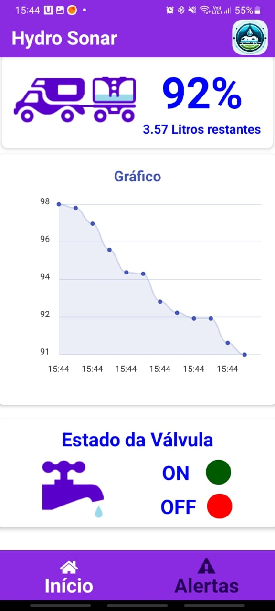
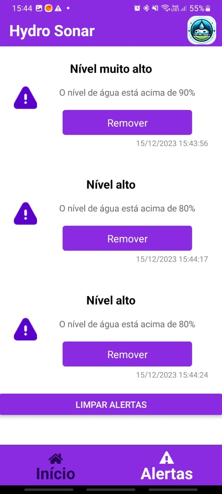
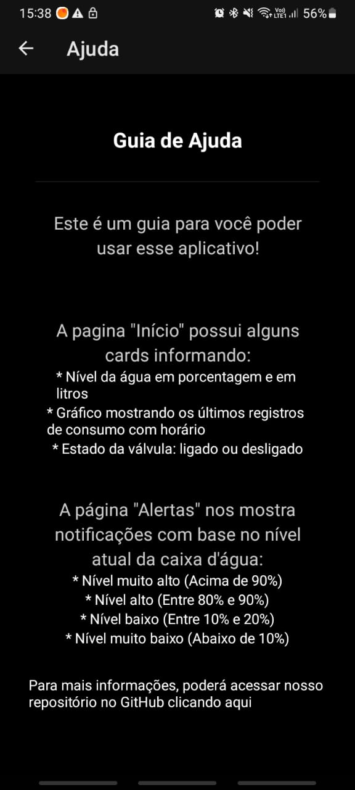

# Telas do Projeto de Controle de Nível de Água - IOT API

Para iniciar o programa, siga estes passos:

Você pode executar o arquivo `start_program.sh` para Linux e para Windows siga o proximo passo a passo. Caso ocorra algum erro na execução desse arquivo, poderá seguir o passo a passo a seguir (esse arquivo estão no diretório Front-end).

   ```
   # No Linux, execute o seguinte comando no terminal
   
   echo "y" | ./start_program.sh
   ```

Certifique-se de estar na pasta Front-end para executar os comandos.

1. **Acesso à Pasta do Projeto:**
   Abra o terminal e navegue até a pasta onde está localizado o projeto. Use o comando `cd` para entrar em cada diretório necessário. Por exemplo:
   ```
   cd hydro_sonar_front
   cd hydrosonar
   ```

2. **Instalação das Dependências:**
   Após acessar a pasta correta do projeto, execute o comando `npm install`. Isso instalará todas as dependências necessárias para o projeto.

   ```
   npm install
   ```

3. **Iniciar o Programa com Expo:**
   Depois de instalar as dependências, inicie o programa usando o Expo. Utilize o comando `npx expo start`.

   ```
   npx expo start
   ```

Estes passos devem permitir que você inicie o programa com sucesso. Certifique-se de estar no diretório correto e de ter todas as dependências necessárias instaladas antes de iniciar o programa.

## Instalação do Aplicativo

Este aplicativo deverá ser instalado no celular para poder visualizar o Front-end desenvolvido (somente para Android).

[Expo Go](https://play.google.com/store/search?q=expo+go&c=apps "Clique aqui e instale o aplicativo no seu celular")

## Iniciar o Aplicativo no Celular

Para poder iniciar o programa desenvolvido pelo Expo Go, você deverá clicar em "Scan QR code" e aproximar a câmera do seu celular para o QR code no terminal onde você executou o arquivo `start_program.sh` / `start_program.bat` ou realizou o último comando `npx expo start`.

## Tela Inicial

A tela inicial exibe informações vitais sobre o sistema de controle de nível de água. Aqui estão os cards principais:



- **Card Dinâmico:** Mostra a quantidade de líquido em litros e em porcentagem.
- **Gráfico de Consumo:** Apresenta informações sobre o consumo por hora.
- **Ilustração do Estado da Válvula:** Representa se a válvula está ligada (ON) ou desligada (OFF).
- **Barra de Navegação:** Permite a alternância entre as abas "Alertas" e "Início".

## Tela de Alertas

Nesta tela, os alertas são apresentados em formato de tabela, contendo as seguintes informações:



- **Tipo de Alerta:** Indica o evento ocorrido (Nível de água acima de 80%, acima do limite ou abaixo de 10%).
- **Data do Alerta:** Informa a data em que o alerta foi acionado.
- **Horário do Alerta:** Apresenta o horário em que o alerta foi acionado.
- **Barra de Navegação:** Similar à tela inicial, essa barra permite a alternância entre as abas "Alertas" e "Início".

## Tela de Modal (Clicando no ícone superior à direita)

Nesta tela, é apresentado um pequeno guia de ajuda:



- **Informações das Duas Telas:** Informa o que tem em cada tela (Alerta e Início) e com mais detalhes fala sobre os tipos de alertas.
